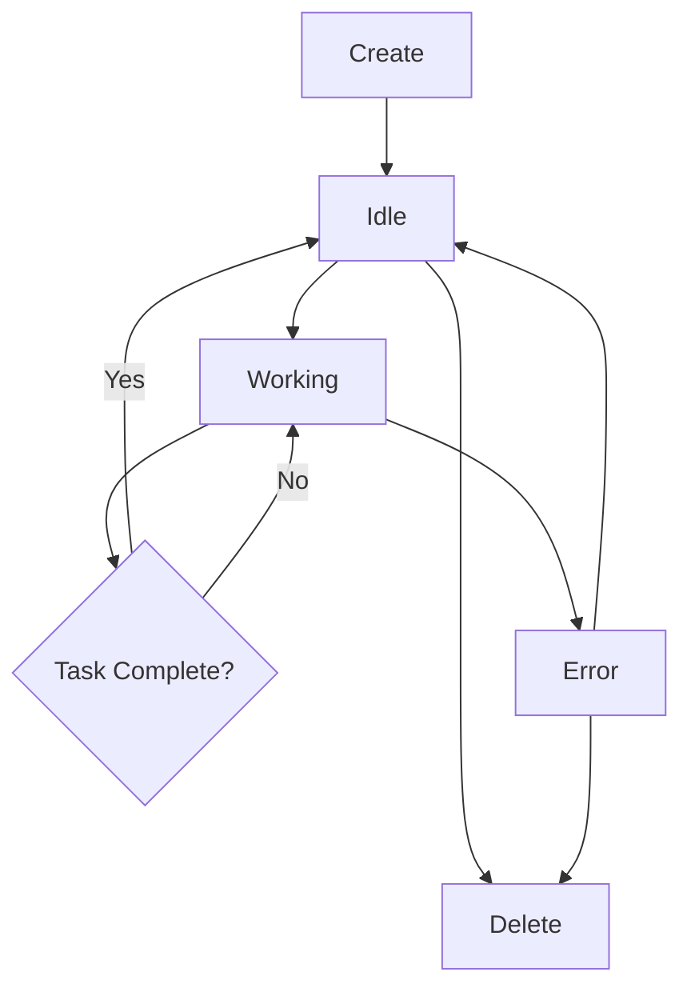

# Agents

Learn about agents in Minion: what they are, how they work, and how to manage them effectively.

## What is an Agent?

An **agent** in Minion is an instance of Claude AI that:

- Operates in an isolated git worktree
- Has its own message history and context
- Can execute tasks independently
- Uses the Claude Agent SDK for tool access
- Maintains its own state and status

## Agent Lifecycle



### 1. Creation

When you create an agent:

```typescript
// User creates agent via UI
const agent = await createAgent({
  id: 'my-agent',
  initialMessage: 'Create a new API endpoint'
});
```

Minion:
1. Creates a git worktree in `.minion/<agent-id>/`
2. Creates a branch `minion/<agent-id>`
3. Initializes Claude Agent SDK instance
4. Sends the initial message
5. Sets status to 'working'

### 2. Working

The agent:
- Receives and processes messages
- Uses tools (Read, Write, Edit, Bash, etc.)
- Makes changes in its worktree
- Commits changes to its branch
- Reports progress

### 3. Idle

After completing a task:
- Status changes to 'idle'
- Agent waits for next message
- Can be assigned new tasks
- Can be merged or deleted

### 4. Deletion

When deleted:
- Agent instance is destroyed
- Worktree is removed
- Branch is deleted (optional)
- Resources are freed

## Agent Structure

```typescript
interface Agent {
  // Identification
  id: string;                    // Unique identifier

  // State
  status: 'idle' | 'working' | 'error';
  worktreePath: string;          // Path to git worktree

  // Communication
  messages: AgentMessage[];      // Message history

  // Metadata
  createdAt: Date;

  // SDK instance (internal)
  sdk: AgentSDKInstance;
}
```

## Agent Messages

Each message in the agent's history:

```typescript
interface AgentMessage {
  role: 'user' | 'assistant';
  content: string;
  timestamp: Date;
  toolUse?: ToolUse[];
}
```

### Message Flow

```
User → Agent: "Create a new file called test.ts"
         ↓
Agent → Tools: Write tool to create file
         ↓
Tools → Agent: File created
         ↓
Agent → User: "I've created test.ts with..."
```

## Agent Capabilities

### Available Tools

Agents have access to:

1. **File Operations**
   - `Read` - Read file contents
   - `Write` - Create new files
   - `Edit` - Modify existing files
   - `Glob` - Find files by pattern

2. **Code Operations**
   - `Grep` - Search code
   - `Task` - Run subtasks

3. **Shell Operations**
   - `Bash` - Execute commands

4. **Git Operations**
   - Commit changes
   - View history
   - Branch operations (in worktree)

### Example: Agent Using Tools

```typescript
// User message: "Find all TODO comments and create a list"

// Agent thinks:
// 1. Use Grep to find TODO comments
// 2. Parse results
// 3. Use Write to create todo-list.md

await agent.useTools([
  {
    name: 'Grep',
    parameters: {
      pattern: 'TODO:',
      output_mode: 'content'
    }
  },
  {
    name: 'Write',
    parameters: {
      file_path: 'todo-list.md',
      content: '# TODOs\n\n...'
    }
  }
]);
```

## Agent Isolation

### Workspace Isolation

Each agent has its own worktree:

```
Repository Root/
├── .git/                    # Shared
├── src/                     # Main branch
├── package.json            # Main branch
└── .minion/
    ├── agent-1/            # Agent 1's workspace
    │   ├── .git           # Symlink to ../.git
    │   ├── src/           # Independent copy
    │   └── package.json   # Independent copy
    └── agent-2/            # Agent 2's workspace
        ├── .git           # Symlink to ../.git
        ├── src/           # Independent copy
        └── package.json   # Independent copy
```

### Benefits

- **No Conflicts**: Agents can't interfere with each other
- **Parallel Work**: Multiple agents work simultaneously
- **Independent State**: Each agent has its own file state
- **Safe Experimentation**: Changes are isolated until merged

### Limitations

- **Disk Space**: Each worktree duplicates files (not `.git`)
- **Branch Management**: Each agent needs its own branch
- **Merge Complexity**: Multiple agents may create merge conflicts

## Agent Status

### Status Types

```typescript
type AgentStatus = 'idle' | 'working' | 'error';
```

#### Idle

- Agent is ready for new tasks
- No active processing
- Can receive messages
- Can be deleted safely

#### Working

- Agent is processing a message
- Using tools and making changes
- Should not be deleted
- Wait for completion

#### Error

- Agent encountered an error
- Check error message
- May need to retry or delete
- Can still receive recovery messages

### Status Transitions

```
idle → working: User sends message
working → idle: Task completes successfully
working → error: Error occurs
error → working: User sends recovery message
error → idle: Agent resolves error
any → deleted: User deletes agent
```

## Agent Best Practices

### Naming

✅ **Good IDs**:
```
feature-user-auth
fix-memory-leak
refactor-api-layer
docs-readme-update
```

❌ **Bad IDs**:
```
agent1
test
temp
asdf
```

### Task Assignment

✅ **Clear and Specific**:
```
Create a new REST API endpoint at /api/users that:
- Accepts GET requests
- Returns a list of users from the database
- Includes pagination (limit, offset)
- Has proper error handling
```

❌ **Vague**:
```
Make the API better
Fix bugs
Update code
```

### Message Length

- **Short tasks**: 1-2 sentences
- **Medium tasks**: 1 paragraph with bullet points
- **Complex tasks**: Multiple paragraphs with detailed requirements

### Agent Limits

**Recommended**:
- 3-5 agents concurrently
- 1-2 agents for complex tasks
- 5-10 agents for simple tasks

**Performance Impact**:
- Each agent uses memory
- Claude API has rate limits
- Git operations have overhead

## Advanced Agent Patterns

### Sequential Tasks

```typescript
// Agent 1: Setup
// Agent 2: Implementation (after agent 1)
// Agent 3: Testing (after agent 2)
```

### Parallel Tasks

```typescript
// Agent 1: Feature A
// Agent 2: Feature B (independent)
// Agent 3: Feature C (independent)
```

### Hierarchical Tasks

```typescript
// Main Agent: Coordinates
//   → Sub-Agent 1: Database
//   → Sub-Agent 2: API
//   → Sub-Agent 3: Frontend
```

## Monitoring Agents

### Via Web UI

- Real-time status indicator
- Message history
- Creation timestamp
- Git diff viewer

### Via API

```bash
# List all agents
curl http://localhost:3000/agents

# Get specific agent
curl http://localhost:3000/agents/my-agent

# Check agent diff
curl http://localhost:3000/agents/my-agent/diff
```

### Via Git

```bash
# List all worktrees
git worktree list

# Check agent's branch
git log minion/my-agent

# View agent's changes
git diff main..minion/my-agent
```

## Troubleshooting Agents

### Agent Not Responding

**Symptoms**:
- Status stuck on "working"
- No new messages
- UI not updating

**Solutions**:
```bash
# Check server logs
npm start

# Restart server
# Agents are recreated from worktrees
```

### Agent Errors

**Symptoms**:
- Status shows "error"
- Error message in UI

**Solutions**:
- Read error message carefully
- Send recovery message
- Delete and recreate if needed

### Merge Conflicts

**Symptoms**:
- Merge fails
- Conflict markers in files

**Solutions**:
```bash
# Manual resolution
cd .minion/my-agent
# Fix conflicts
git add .
git commit
# Then merge from main branch
```

## Next Steps

- [Creating Agents](/guide/creating-agents) - Detailed creation guide
- [Managing Agents](/guide/managing-agents) - Lifecycle management
- [Best Practices](/guide/best-practices) - Tips and tricks
