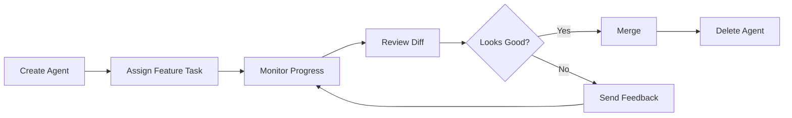
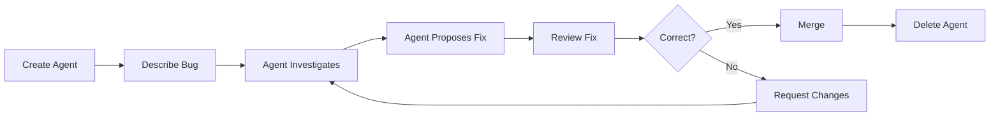

# Quick Start

This tutorial will walk you through creating your first agent and having it perform a simple task.

## Before You Begin

Make sure you've completed the [Getting Started](/guide/getting-started) guide and have:

- ✅ Minion installed
- ✅ Anthropic API key set
- ✅ Server running at http://localhost:3000
- ✅ Web UI accessible in your browser

## Step 1: Create Your First Agent

1. **Open the Web UI**

   Navigate to `http://localhost:3000` in your browser.

2. **Click "Create New Agent"**

   You'll see a modal dialog with two fields:
   - **Agent ID**: Unique identifier for this agent
   - **Initial Message**: The task you want the agent to perform

3. **Enter Agent Details**

   ```
   Agent ID: my-first-agent
   Initial Message: Create a new file called hello.txt with "Hello from Minion!" inside
   ```

4. **Click "Create"**

   The agent will be created and you'll see a new card appear in the agents grid.

## Step 2: Monitor Agent Progress

Watch as your agent:

1. **Receives the task** - Status shows "working"
2. **Creates the worktree** - A new git worktree is created in `.minion/my-first-agent`
3. **Executes the task** - Agent writes the file
4. **Reports completion** - Status updates to "idle" or "completed"

The message history on the agent card shows the conversation between you and the agent.

## Step 3: View the Changes

1. **Click "View Diff"** on the agent card

   This shows you the git diff of changes made by the agent.

2. **Check the file system**

   ```bash
   # View the worktree
   ls .minion/my-first-agent/

   # Read the file
   cat .minion/my-first-agent/hello.txt
   ```

   You should see:
   ```
   Hello from Minion!
   ```

## Step 4: Send Another Message

You can continue the conversation with the agent:

1. **Click "Assign Task"** on the agent card
2. **Enter a new message**:
   ```
   Now add the current date to the file
   ```
3. **Click "Send"**

The agent will:
- Read the existing file
- Append the current date
- Report completion

## Step 5: Merge the Changes

If you're happy with the agent's work:

1. **Click "Merge"** on the agent card
2. **Confirm the merge**

The changes from the agent's worktree will be merged into your main branch.

## Step 6: Clean Up

When you're done with the agent:

1. **Click "Delete"** on the agent card
2. **Confirm deletion**

This will:
- Remove the agent instance
- Delete the git worktree
- Clean up the branch

## Understanding What Happened

Let's break down what Minion did behind the scenes:

### 1. Agent Creation

```typescript
// Minion created:
// - New Claude Agent SDK instance
// - Git worktree in .minion/my-first-agent/
// - New branch: minion/my-first-agent
```

### 2. Task Execution

```typescript
// Agent used Claude Agent SDK to:
// - Understand your natural language request
// - Execute the Write tool to create hello.txt
// - Commit changes to its branch
```

### 3. Isolation

```
Your repository:
├── .minion/
│   └── my-first-agent/    ← Agent's isolated workspace
│       └── hello.txt       ← Changes here
└── (main branch)           ← Unchanged (until merge)
```

### 4. Merge Process

```bash
# Minion executed:
git checkout main
git merge minion/my-first-agent
```

## Try More Complex Tasks

Now that you understand the basics, try these:

### Code Generation

```
Agent ID: feature-api
Message: Create a new REST API endpoint in src/api/users.ts that returns a list of users
```

### Refactoring

```
Agent ID: refactor-auth
Message: Refactor the authentication logic in src/auth.ts to use async/await instead of callbacks
```

### Bug Fixing

```
Agent ID: fix-memory-leak
Message: Find and fix the memory leak in the worker process (src/workers/processor.ts)
```

### Documentation

```
Agent ID: docs-readme
Message: Update the README.md with a comprehensive API documentation section
```

## Working with Multiple Agents

Create multiple agents to work in parallel:

```bash
# Agent 1
Agent ID: frontend-task
Message: Add dark mode toggle to the settings page

# Agent 2
Agent ID: backend-task
Message: Add rate limiting middleware to the API

# Agent 3
Agent ID: fix-bug
Message: Fix the race condition in the cache invalidation logic
```

All three agents work simultaneously without conflicts!

## Best Practices

### ✅ Do

- Give agents clear, specific tasks
- Use descriptive agent IDs
- Monitor agent progress regularly
- Review changes before merging
- Delete agents when done

### ❌ Don't

- Create too many agents at once (start with 2-3)
- Give vague instructions
- Merge without reviewing
- Forget to clean up old agents
- Reuse agent IDs

## Common Workflows

### Feature Development



### Bug Fixing



## Next Steps

- [Creating Agents](/guide/creating-agents) - Learn advanced agent creation
- [Managing Agents](/guide/managing-agents) - Agent lifecycle management
- [Merging Changes](/guide/merging-changes) - Best practices for merging
- [Best Practices](/guide/best-practices) - Tips for effective workflows

## Troubleshooting

### Agent not responding

- Check the WebSocket connection (green indicator in UI)
- Refresh the page
- Check server logs for errors

### Changes not visible

- Make sure you're looking in the correct worktree (`.minion/<agent-id>/`)
- Agent might still be working (check status)

### Merge conflicts

- Review the diff carefully
- Resolve conflicts manually in the worktree
- Or delete and recreate the agent with updated instructions

## Congratulations! 🎉

You've successfully created, used, and managed your first Minion agent. You're now ready to orchestrate multiple AI agents for parallel development!
